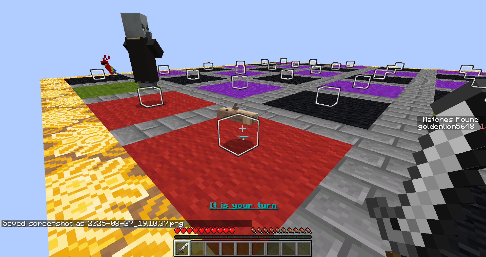

## Minecraft Memory Matching Minigame

This is a minecraft minigame map that runs on mcfunction files generated using [a python script](datapacks/matching/data/matching/functions/matching/gen_matching_files.py) which makes use of my [PythonToMcfunctionTranspiler](https://github.com/Goldenlion5648/PythonToMcfunctionTranspiler/blob/master/python_helpers/helper_functions.py)

The gameplay is the classic memory matching game where a player selects a "card," then chooses a second card, and if they match, the cards stay facing up. If the cards do not match, both are flipped face down again.

The board looks like this by default:

Once the game is over, it looks like this:

This game can be played in single player or multiplayer. If played in multiplayer, the game enforces players taking turns in a round robin ordering, or optionally a "make it, take it" mode where a player can go again after a correct match.

These are the game settings: (the grid size, and whether or not "make it, take it" mode is enabled)

An example of "Make it, Take it:"

In the following image, a player has made their first pick (which had an Evoker), and is about to make their second choice (by hitting the white cube).

In this case, the Cod does not match the Evoker so both cards go back face down.

